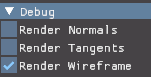

# Vulk

This is the second renderer I'm taking a serious shot at after VulkanRenderer which was a great sandbox for doing lots of things but was weighing me down.

The goal of my previous project was to do enough hand-rolled stuff that I could really grok what the fundamentals of vulkan were. mission accomplished.

My goal for this project is to transition from the hand-coded samples I was doing before to a more data-driven engine capable of loading and rendering resources so I can focus on learning new rendering technologies by building them. One outcome I'd like is to have a modern renderer that displays lit rendered scenes on par with modern games (if not as efficiently or with as much capability)

# Resources

* <https://learnopengl.com/Advanced-Lighting/Normal-Mapping> - good tangent space intro
* <https://blog.selfshadow.com/> - blog on graphics
* <https://iquilezles.org/>
* <https://www.shadertoy.com/view/4sSfzK> - pbr shadertoy
* <https://research.ncl.ac.uk/game/mastersdegree/graphicsforgames/deferredrendering/Tutorial%2015%20-%20Deferred%20Rendering.pdf>
* <https://learnopengl.com/Advanced-OpenGL/Cubemaps>
* <https://github.com/SaschaWillems/Vulkan> - a set of good vulkan examples

3D resources:

* <https://polyhaven.com/a/symmetrical_garden_02>

# Setup

* Install [Vulkan SDK](https://vulkan.lunarg.com/sdk/home)
* make sure your VULKAN_SDK environment variable is set
* Clone the repo
* mkdir build
* make sure you have git lfs installed. you may need to do a git lfs pull.

# Building

* cd build
* cmake ..
* cmake --build .
* (optional - run tests) ctest -C Debug (or however you built it) in the build directory

# TODOs

* invert the TBN matrix: So now that we have a TBN matrix, how are we going to use it? There are two ways we can use a TBN matrix for normal mapping, and we'll demonstrate both of them:
  * We take the TBN matrix that transforms any vector from tangent to world space, give it to the fragment shader, and transform the sampled normal from tangent space to world space using the TBN matrix; the normal is then in the same space as the other lighting variables.
  * We take the inverse of the TBN matrix that transforms any vector from world space to tangent space, and use this matrix to transform not the normal, but the other relevant lighting variables to tangent space; the normal is then again in the same space as the other lighting variables. - this is better because we can do this in vertex space and then use the interpolated values.
* <https://github.com/KHeresy/openxr-simple-example> : integrate with OpenXR
* <https://www.reddit.com/r/GraphicsProgramming/comments/1ay0j70/realtime_pbr_catchup_developments_in_recent_years/> - chock full of links
* check out siggraph courses
  * <https://blog.selfshadow.com/publications/s2014-shading-course/>
* <https://www.unrealengine.com/en-US/blog/physically-based-shading-on-mobile>
* <https://blog.selfshadow.com/publications/s2013-shading-course/>
* some basics I haven't done yet
  * mipmaps
  * spheremap
  * cubemap
  * need to check that the materials models ref in a scene actually exist.

# Diagrams

## Renderpass Components


# Log

# Deferred Rendering

TODOS:

* pack roughness into the material, make sure ao is in the r field (see TODOs)
* depth buffer: I think I should just use the depth buffer I'm already allocating in Vulk.
* I also don't know if the 2 subpass needs the depth buffer?

## 7/27 deferred lighting phase vert shader

For this we need to draw a quad across normalized device coordinates (-1 - 1) in x/y and
just process the gbufs. rather than pass any verts in let's just generate them in the vert shader
*

* call vkCmdDraw(cmdBuffer, 4, 1, 0, 0)
* use gl_VertexIndex to look up the buffers

## 7/27

Vulk: ERROR: 2 message: Validation Error: [ VUID-vkCmdEndRenderPass-None-00910 ] Object 0: handle = 0x1ef8b8c6b00, type = VK_OBJECT_TYPE_COMMAND_BUFFER; | MessageID = 0x7a3c5b09 | vkCmdEndRenderPass: Called before reaching final subpass. The Vulkan spec states: The current subpass index must be equal to the number of subpasses in the render pass minus one (<https://vulkan.lunarg.com/doc/view/1.3.250.1/windows/1.3-extensions/vkspec.html#VUID-vkCmdEndRenderPass-None-00910>)

forgot to call "vkCmdNextSubpass"

## 7/26

Vulk: ERROR: 2 message: Validation Error: [ VUID-VkGraphicsPipelineCreateInfo-renderPass-07609 ]
Object 0: handle = 0x28c10b627f0, type = VK_OBJECT_TYPE_DEVICE; | MessageID = 0x583c7182 | vkCreateGraphicsPipelines() pCreateInfo[0]: VkRenderPass 0xee24d0000000059[] subpass 1 has colorAttachmentCount of 1 which doesn't match the pColorBlendState->attachmentCount of 4.

Vulk: ERROR: 2 message: Validation Error: [ VUID-VkGraphicsPipelineCreateInfo-layout-07989 ]
Object 0: handle = 0x1d4e2e0000000062, type = VK_OBJECT_TYPE_SHADER_MODULE;
Object 1: handle = 0x9f58380000000064, type = VK_OBJECT_TYPE_PIPELINE_LAYOUT; | MessageID = 0xfccb53e7 | vkCreateGraphicsPipelines(): pCreateInfos[0]
Set 0 Binding 3 type mismatch on descriptor slot in shader (VK_SHADER_STAGE_FRAGMENT_BIT), uses type VK_DESCRIPTOR_TYPE_UNIFORM_BUFFER but expected VK_DESCRIPTOR_TYPE_COMBINED_IMAGE_SAMPLER The Vulkan spec states: If a resource variables is declared in a shader, a descriptor slot in layout must match the descriptor type (<https://vulkan.lunarg.com/doc/view/1.3.250.1/windows/1.3-extensions/vkspec.html#VUID-VkGraphicsPipelineCreateInfo-layout-07989>)

Vulk: ERROR: 2 message: Validation Error: [ VUID-VkRenderPassBeginInfo-clearValueCount-00902 ] Object 0: handle = 0xee24d0000000059, type = VK_OBJECT_TYPE_RENDER_PASS; | MessageID = 0x4de051e3 | In vkCmdBeginRenderPass the VkRenderPassBeginInfo struct has a clearValueCount of 5 but there must be at least 7 entries in pClearValues array to account for the highest index attachment in VkRenderPass 0xee24d0000000059[] that uses VK_ATTACHMENT_LOAD_OP_CLEAR is 7. Note that the pClearValues array is indexed by attachment number so even if some pClearValues entries between 0 and 6 correspond to attachments that aren't cleared they will be ignored. The Vulkan spec states: clearValueCount must be greater than the largest attachment index in renderPass specifying a loadOp (or stencilLoadOp, if the attachment has a depth/stencil format) of VK_ATTACHMENT_LOAD_OP_CLEAR (<https://vulkan.lunarg.com/doc/view/1.3.250.1/windows/1.3-extensions/vkspec.html#VUID-VkRenderPassBeginInfo-clearValueCount-00902>)

Vulk: ERROR: 2 message: Validation Error: [ VUID-vkCmdBeginRenderPass-initialLayout-00897 ]

Object 0: handle = 0xee24d0000000059, type = VK_OBJECT_TYPE_RENDER_PASS;
Object 1: handle = 0x4868e6000000005a, type = VK_OBJECT_TYPE_FRAMEBUFFER;
Object 2: handle = 0x535b660000000043, type = VK_OBJECT_TYPE_IMAGE_VIEW;
Object 3: handle = 0x6612e40000000041, type = VK_OBJECT_TYPE_IMAGE;

| MessageID = 0x961074c1 |

vkCmdBeginRenderPass(): Layout/usage mismatch for attachment 0 in VkRenderPass 0xee24d0000000059[] -

the final layout is VK_IMAGE_LAYOUT_SHADER_READ_ONLY_OPTIMAL but the image attached to VkFramebuffer 0x4868e6000000005a[] via VkImageView 0x535b660000000043[] was not created with VK_IMAGE_USAGE_INPUT_ATTACHMENT_BIT or VK_IMAGE_USAGE_SAMPLED_BIT.

Image usage: VK_IMAGE_USAGE_COLOR_ATTACHMENT_BIT. The Vulkan spec states: If any of the initialLayout or finalLayout member of the VkAttachmentDescription structures or the layout member of the VkAttachmentReference structures specified when creating the render pass specified in the renderPass member of pRenderPassBegin is VK_IMAGE_LAYOUT_SHADER_READ_ONLY_OPTIMAL then the corresponding attachment image view of the framebuffer specified in the framebuffer member of pRenderPassBegin must have been created with a usage value including VK_IMAGE_USAGE_SAMPLED_BIT or VK_IMAGE_USAGE_INPUT_ATTACHMENT_BIT (<https://vulkan.lunarg.com/doc/view/1.3.250.1/windows/1.3-extensions/vkspec.html#VUID-vkCmdBeginRenderPass-initialLayout-00897>)

## 7/24 vkCreateRenderPass failing

why? `pSubpasses[1].pDepthStencilAttachment attachment 6 must be less than the total number of attachments 5. The Vulkan spec states: If the attachment member of any element of pInputAttachments, pColorAttachments, pResolveAttachments or pDepthStencilAttachment, or any element of pPreserveAttachments in any element of pSubpasses is not VK_ATTACHMENT_UNUSED, then it must be less than attachmentCount`

* numAttachments is 5
* but our depth attachment is at idx 6 apparently.

ah! just didn't increment the attachment count properly for the color/depth for subpass 2 (our output bufs)

* note: I'm using the depth buffer still for some reason...

## 7/14 wire up the imageviews

* x create the image/imageviews/devicemem for the gbufs (normal, albedo,...)
* x make the renderpass
  * x declare the geo subpass
  * x declare the lighting subpass
* x make the geo framebuffer
* make the pipelines
  * x geo
  * lighting

## 7/14 how samplers are input to shaders refresher

* the frag shader binds a uniform of type sampler2D: `layout(binding = 12) uniform sampler2D shadowSampler;`
* VulkDescriptorSetLayout specifies what this binding is:

  ```C
        VkDescriptorSetLayoutBinding layoutBinding{};
        layoutBinding.binding = binding;
        layoutBinding.descriptorType = VK_DESCRIPTOR_TYPE_COMBINED_IMAGE_SAMPLER;
        layoutBinding.descriptorCount = 1;
        layoutBinding.stageFlags = stageFlags;
  ```

* a VulkDescriptorSet gets built for each frame that contains the VkSampler and VkImageView.

  ```C
      VkDescriptorImageInfo imageInfo{};
      imageInfo.imageLayout = VK_IMAGE_LAYOUT_SHADER_READ_ONLY_OPTIMAL;
      imageInfo.imageView = imageView;    // VkImageView
      imageInfo.sampler = textureSampler; // VkSampler 
  ```

VulkDescriptorSetInfo takes the layout, pool,

## 7/12

deferred renderpass creation works as follows:

* create the image/imageviews/devicemem for the gbufs (normal, albedo,...)
* make the renderpass
  * declare the geo subpass
  * declare the lighting subpass
* make the geo framebuffer
* make the pipelines
  * geo
  * lighting

## 7/9

## bug: attachment final layout

Layout/usage mismatch for attachment 0 in VkRenderPass 0xee24d0000000059[] -
the final layout is VK_IMAGE_LAYOUT_TRANSFER_SRC_OPTIMAL
but the image attached to VkFramebuffer 0x4868e6000000005a[] via VkImageView 0x535b660000000043[]
was not created with VK_IMAGE_USAGE_TRANSFER_SRC_BIT.

fix: I'm not doing a src transfer, just change it to VK_IMAGE_LAYOUT_SHADER_READ_ONLY_OPTIMAL

## 7/7 I aint getting shit done

## Framebuffers and what gets displayed refresher

* a framebuffer:
  * operates in conjunction with a renderpass
  * represents a set of memory attachments the renderpass uses

How does this get rendered to a surface?

* VkSwapchainKHR: provides the ability to present rendering results to a surface
* swapChainImages: vector<VkImage>, get this from vkGetSwapchainImagesKHR
* swapChainImageViews[] = createImageView from the images
* swapChainFramebuffers[] : made from the image views.

## 7/1 man I'm feeling slow

* let's do an end-to-end gbuf by hand and see if we want a generic VulRenderpass after that.
* Albedo attachment
* geo subpass
* lighting subpass
* make the renderpass and framebuffers

VulkRenderpass:

* addColorAttachment(VulkShaderBinding, VkFormat, VkImageLayout?, ) : this would add one of:
  * VkAttachmentDescription
  * VkAttachmentReference
  * VkImageView (and mem etc.)

## 6/29 Deferred Shading Cont

Ugh. work be taking too much of my time.

* create the buffers:
  * Albedo Buffer (VK_FORMAT_R8G8B8A8_UNORM): Stores the base color (diffuse reflectance) of the surfaces.
  * Normal Buffer (VK_FORMAT_R16G16B16A16_SFLOAT): Stores the surface normals, which are used for lighting calculations.
  * Depth Buffer (VK_FORMAT_D32_SFLOAT): Stores the depth information (z-values) of the scene, used to reconstruct positions.
  * Specular Buffer (VK_FORMAT_R8G8B8A8_UNORM): Stores specular reflectance properties, such as intensity and shininess.
  * Material Properties Buffer (VK_FORMAT_R8G8B8A8_UNORM): pack some of these in a special material buf: metallic, roughness, ao
* make a render pass with a framebuffer that has these images as a target to be rendered to
  *
* do the geometry pass
  * just copy these values into the buffers
* do the lighting pass
  * render a fullscreen quad.
  * extract the pos from the depth buffer
  * pass the lights
  * write the PBR shader using this data.

refresher: VulkPickView and renderpass/render frames/images

The picker we wrote does exactly what we want: renders to a target and then we get the data back. how did it work again?

* creating the objects for it:
  * image: VkDeviceMemory, VkImage, VkImageView
  * render target: VkFrameBuffer
  * render pass: render target/imageview/descriptorset
  * pipeline: pick shaders, descriptor sets, renderpass.
* rendering:
  * before: transition the current image to an optimized state to receive the rendered actors
  * during: render actors normally using the VkImageView/VkFrameBuffer and a push buffer for the actor id. the shaders render the id into the imageview
  * after: transition the image back to something the CPU can read, and makes it available in CPU land.

A little deeper on the renderpass:

* VkRenderPass
  * VkAttachmentDescription: a set of attachment formats and operations during render (load/store/device optimal)
    "If the attachment uses a color format, then loadOp and storeOp are used, and stencilLoadOp and stencilStoreOp are ignored. If the format has depth and/or stencil components, loadOp and storeOp apply only to the depth data, while stencilLoadOp and stencilStoreOp define how the stencil data is handled"
  * VkSubpassDescription:
* VkAttachmentDescription : specifies what happens at various stages in the rp to the attachmemt:
  * loadOp = VK_ATTACHMENT_LOAD_OP_CLEAR;   // Clear  at the start of the render pass
  * storeOp = VK_ATTACHMENT_STORE_OP_STORE; // Store the  information after rendering
  * finalLayout = VK_IMAGE_LAYOUT_TRANSFER_SRC_OPTIMAL
* VkAttachmentReference
  * attachment: what attachment index this refers to
  * layout: what the layout will be transitioned to during a subpass.

both VkAttachmentDescription and VkAttachmentReference spacify a layout. initialLayout is a check for what
the layout should be at the start of a renderpass. see this diagram:

Render Pass
  ├─ Initial Layout Transition (initialLayout)
  │   ├─ Subpass 1
  │   │   ├─ VkAttachmentReference::layout (for Subpass 1)
  │   ├─ Subpass 2
  │   │   ├─ VkAttachmentReference::layout (for Subpass 2)
  ├─ Final Layout Transition (finalLayout)

## 6/25 Deferred Rendering

* <https://developer.nvidia.com/gpugems/gpugems3/part-iii-rendering/chapter-19-deferred-shading-tabula-rasa>
* Realtime Rendering 4th edition

Nutshell:

* in forward lighting if you have N objects and M lights you potentially have an NxM computational cost
* with deferred you process all the geometry first, then do the lighting per pixel, so
  * you get an N + M cost instead of a combinatorial one
  * you remove unnecessary computation in the case of overdraw
  * at the cost of more memory
  * it also doesn't work well with transparent objects - these are often done forward

Okay so to do this I need to:

* prep
  * we need screen-space buffers for:
    * material properties: albedo, normal, specular, metallic, roughness, ambient occlusion
      * note: may want to pack some of these in a special material buf: metallic, roughness, ao
* do the geometry pass
  * just copy these values into the buffers
* do the lighting pass
  * render a fullscreen quad.
  * extract the pos from the depth buffer
  * pass the lights
  * write the PBR shader using this data.

## 6/16 OpenXR

* <https://developer.oculus.com/documentation/native/android/book-intro/>
* <https://developer.oculus.com/documentation/native/android/book-native/>
* <https://developer.oculus.com/documentation/native/android/mobile-openxr>
* <https://developer.oculus.com/documentation/native/android/mobile-openxr-instance-session/>

Building:

* picked C:\open\openxr\ovr_openxr_mobile_sdk_65.0\Samples\XrSamples\XrColorSpaceFB\ as it looked simple
* for cmake presets:
  * I first made a ninja/clang one, all sorts of errors
  * made a cl based one, worked just fine.
* config'd and compiled fine
* C:\open\openxr\ovr_openxr_mobile_sdk_65.0\Samples\out\build\cl_x64\XrSamples\XrColorSpaceFB\Debug

Failing on startup, let's see:

* XrApp::Init (in C:\open\openxr\ovr_openxr_mobile_sdk_65.0\Samples\SampleXrFramework\Src\XrApp.cpp)
  * calls xrGetSystem(Instance, &systemGetInfo, &systemId) (in C:\open\openxr\ovr_openxr_mobile_sdk_65.0\Samples\3rdParty\openxr\src\loader\xr_generated_loader.cpp)
    * loader_instance = ActiveLoaderInstance::Get(&loader_instance, "xrGetSystem") (C:\open\openxr\ovr_openxr_mobile_sdk_65.0\Samples\3rdParty\openxr\src\loader\loader_instance.cpp)
      * std::unique_ptr LoaderInstance & GetSetCurrentLoaderInstance()
        * LoaderInstance (C:\open\openxr\ovr_openxr_mobile_sdk_65.0\Samples\3rdParty\openxr\src\loader\loader_instance.hpp)
    * loader_instance->DispatchTable()->GetSystem(instance, getInfo, systemId);

## 6/15 fixing our projection


As you can see from this our axis should go right, up, and away from the cam. Instead
we have right down and towards. this is technically correct except that the world needs
to be rotated by 180 degrees around the x axis.

Spaces refresher:

From <https://johannesugb.github.io/gpu-programming/setting-up-a-proper-vulkan-projection-matrix/>


* world space - the 3d space your objects live in. e.g. my axes which have the 3d coordinates such that they meet at 0,0,0 and extend to (1,0,0), (0,1,0), and (0,0,1) respectively
* view space - the transformation that moves what is visible into a cube from -w to w
* clip space: (-w,-w,0) to (w,w,w) - this is the first fixed-function stages.
* normalized device coordinates: post divide by w, (-1,-1,0) to (1,1,1)
* framebuffer space: 2d pixels x - right, y - down


You can see here that by the time you're in clip space. let's just try flipping clip space:


## 6/15 fixing the axes

why isn't up up? need to figure that out.
would also be nice to have labels/color on the axes

adding coloring for the axes: feeling lazy, let's pack coloring info in the uvs:

* x - red, y - green, z - blue

let's just use a 0-1 to map from red,green,blue

## 6/24 cubemaps part 3

*sigh* that dds library I found clearly doesn't work and is just copied from some MS example. let's just
load the images from six files

quick refresher on getting images into GPU mem:

* every image really needs an image and imageMemory (and the shader takes an imageView)
* VkImages can have 'layers' which are really images within a VkImage. the layers are used for two things:
  * array textures: a set of 2D images with the same properties (width/height/depth, format - VK_FORMAT_R8G8B8A8_SRGB, miplevel etc.). useful for sprite sheets
  * cubemaps: a special case of array textures.

to get an image from disk into a format the shader can access you have to:

1. load the images into cpu mem
2. make a staging buffer and copy the data to that
3. allocate an image and bind it to device mem
4. copy the data from the staging buffer to the image
5. transition the image to a shader readable format

okay, now I've got a dsdef expecting certain shaders on the model but they don't exist...


First cubemap. is this right? I should be seeing Y up

Let's draw some axes:


## 6/12 cubemaps again

How do textures get loaded again?

* each pipeline has a descriptorset def
* and each descriptor set has a set of texture bindings:
  * TextureSampler,
  * ...
  * RoughnessSampler
* VulkResourcesMetadata: parses .mtl files which specify these fields (e.g. rougness, specular, etc.)
* VulkResources then creates a VulkMaterialTextures object in VulkResources::getMaterialTextures
  * this is where the GPU resources get allocated in vulkan
* VulkModel takes a VulkMaterialTextures parameter for binding and holds it so it isn't deallocated
* VulkActor
* a scene holds the actors
  * each actor

## 6/11 cube maps

I just realized I haven't done these yet, let's see what vulkan has:

* <https://learnopengl.com/Advanced-OpenGL/Cubemaps>

What do we need to do for Vulkan:

* VK_IMAGE_CREATE_CUBE_COMPATIBLE_BIT : `specifies that the image can be used to create a VkImageView of type VK_IMAGE_VIEW_TYPE_CUBE or VK_IMAGE_VIEW_TYPE_CUBE_ARRAY.`
* , cubeMapImage, VK_FORMAT_R8G8B8A8_UNORM, VK_IMAGE_LAYOUT_UNDEFINED, VK_IMAGE_LAYOUT_TRANSFER_DST_OPTIMAL, subresourceRange);

As usual for me, getting resources is the hardest part.

Steps:

* get a cubemap:
  * I found this <https://opengameart.org/content/cubemap-for-calibrate-skybox> : cubetable512.dds
* load it : stb can do that
* make the image/view/accessible in a shader
* sample it properly: let's use a sphere.

## 6/10

Build process now:

* compile exe
* launch project builder
  * which copies the necessary files over to the directory where the exe is built (abouts)
* runtime:
  * load this built project file

## 6/9 asdf

Switching over to project files or something:

* let's put everything we need in subdirectories of the project
* buildtool can recursively scan these things and build a single .proj file out of it
* when the exe runs it just loads this file

a project:

* has scenes
  * actors
    * pipelines
      * vert
      * frag

As we process a scene it seems like we want to slurp everything into our big project file...

* why don't we compile the shaders into files, slurp those into a shaderdef and then write the shaderdef to the destination dir and write the path out too...
* philosophically we keep the metadata small and atomic and reference the big data in a way that is fast to update...

So:

* metadata includes things like actors, pipelines, etc.
* datadata refers to bigger things: compiled shaders, meshes, textures

How do we update these?

1. leverage cmake
2. compare times ourselves
3. ...

so we do this:

* recursively scan the directories for all the resources
*

## 6/9 compilation

since I've been doing nothing but procrastinate, maybe I'll take another shot at compile times.

* baseline pbr compile: ~13s
* fucking god damn, what a waste of time.

## 6/8

* remove .fbs files DONE
* Remove VulkEnumMetadata DONE
* remove cereal refs DONE
* remove nlohmann refs DONE

okay, just noticed something funny with resource loading

* when we load the pipeline we make a VulkDescriptorSetLayoutBuilder from the pipeline
* when we load an actor for the scene we use a VulkDescriptorSetBuilder which we use to bind scene resources to the

descriptorSetLayoutCache isn't necessary: the pipeline and the layout have a 1-1 relationship. let's remove it.

but createActorFromPipeline takes a PipelineDef and not a Pipeline? eh, seems fine.

rendering is busted, let's renderdoc it: blending was incorrect. fixed

## 6/7

load source json files with enum strings.
convert cull mode from string

## 6/5

ClCompile is passing /MDd which conflicts elsewhere. for some reason its not the same...

## 6/4 cereal-b-gone

How does this work end-to-end for descriptorsetdef?

1. write a pipeline with shaders
2. buildtool extracts the DS and makes a def out of it
3. the def is serialized as part of the pipeline

so:

* no json to read in
* just need to write it out.

why don't I write it as a separate file and just load that?

* remove it from PipelineDef
* load it in VulkResources
* connect the two

## 6/2 ditch nlohmann/json and cereal

these things are slow and hard to debug. we've got flabuffers, what would it take to convert those?

let's see if we can thrift up DescriptorSetDef and see how it goes

* TODO: need the buildtool to build this properly

## 6/2 slow builds investigation

final results:

* halved full build time and pbr.cpp build and link time

random segue: builds are slow:

* without incremental
  * full build: 42s
  * no changes: 2.63
  * pbr.cpp: 11.68
* let's turn on incremental linking.
  * full build: 40.6
  * no changes: 2.42s
    * pbr.cpp changed: 11.03
* let's try ninja + clang
  * full build: 22s
  * no changes: 0s
  * pbr.cpp: 8s

so incremental linking does basically nothing, blarg. 11 seconds just feels really long to compile and link a 5mb file

clang + ninja definitely faster.

Let's keep digging:

* set(CMAKE_CXX_FLAGS "${CMAKE_CXX_FLAGS} -ftime-trace") : doing this enables per file tracing
* I can see in pbr.cpp that including Vulk.h takes the majority of the time: 3.75s
* PerformPendingInstantiations is the next biggest one:
  * The term "PerformPendingInstantiations" typically refers to a phase in the compilation process of C++ programs, particularly when dealing with templates.
* adding pch for Vulk: VulkPCH.h
  * full build: 29s, hmm, worse.
  * pbr.cpp: 6.9s down from 8s
    * Source down to 1.3s from 3.758! nice, 3.5s savings (not sure why it didn't translate to like a 5s build...)
* what if I pch everything in vulk?
  * actually made things slower. probably all the unused crap
  * compiling pbr.cpp itself is only taking 234ms so that's diminishing returns
* next is the PerformPendingInstantations: saved .5s from templates
  * Cereal's JSON reader is super slow. I don't think I use it: 3.192s down to 2.739s, so almost half a sec
  * nlohmann/json.hpp is also taking some time: .3s, but we still need it
* what about CMAKE_UNITY_BUILD? Not worth it.
  * full build: 18 up to 30.7
  * pbr: 6.16 down to 6.081, so a little savings? .08s, meh

Conclusion: at this point almost 3 seconds is dedicated to templates and most of those templates are from
Cereal and json parsers. so... switching over to flatbuffers entirely is the next thing to do if we really
want to save time...

## 6/1 pick data

looks like about 10% of the pixels are covered by the sphere, oh yeah, I remember in renderdoc seeing the projection isn't the same.

* make the projection the same
* I should also revisit all the transition shit I did to make sure it makes sense.

## 6/1 wtf do we have to do to get this buffer readable

1. start a single-time command buffer
2. transition the image to a format we can copy to cpu: from VK_IMAGE_LAYOUT_COLOR_ATTACHMENT_OPTIMAL to VK_IMAGE_LAYOUT_TRANSFER_SRC_OPTIMAL using a vkCmdPipelineBarrier
3. call vkCmdCopyImageToBuffer to copy the image to a buffer
4. submit the commands

when I submit I get: Validation Error: ... expects VkImage .. to be in layout VK_IMAGE_LAYOUT_COLOR_ATTACHMENT_OPTIMAL--instead, current layout is VK_IMAGE_LAYOUT_TRANSFER_SRC_OPTIMAL.

Now, if I look around for VK_IMAGE_LAYOUT_TRANSFER_SRC_OPTIMAL I see it in VulkPickRenderpass in the VkAttachmentDescription: attachment.finalLayout = VK_IMAGE_LAYOUT_TRANSFER_SRC_OPTIMAL

So can I skip this? what format does it need to go back into?

### 1. I notice when I make the renderpass that I specify finalLayout = VK_IMAGE_LAYOUT_TRANSFER_SRC_OPTIMAL in VkAttachmentDescription, maybe I don't need to do the transition?

Okay, so comment out the transition code, let's see what happens:

VkBuffer should have VK_BUFFER_USAGE_TRANSFER_SRC_BIT set during creation. The Vulkan spec states: srcBuffer must have been created with VK_BUFFER_USAGE_TRANSFER_SRC_BIT usage flag (<https://vulkan.lunarg.com/doc/view/1.3.250.1/windows/1.3-extensions/vkspec.html#VUID-vkCmdCopyBuffer-srcBuffer-00118>)

### 2. progress? looks like we need the buffer to have this bit set, fine

Vulk: ERROR: 2 message: Validation Error: [ VUID-vkCmdCopyImageToBuffer-dstBuffer-00191 ] Object 0: handle = 0x189c4a64360, type = VK_OBJECT_TYPE_COMMAND_BUFFER; Object 1: handle = 0x80f3660000000110, type = VK_OBJECT_TYPE_BUFFER; | MessageID = 0x9936f2bd | Invalid usage flag for VkBuffer 0x80f3660000000110[] used by vkCmdCopyImageToBuffer. In this case, VkBuffer should have VK_BUFFER_USAGE_TRANSFER_DST_BIT set during creation. The Vulkan spec states: dstBuffer must have been created with VK_BUFFER_USAGE_TRANSFER_DST_BIT usage flag (<https://vulkan.lunarg.com/doc/view/1.3.250.1/windows/1.3-extensions/vkspec.html#VUID-vkCmdCopyImageToBuffer-dstBuffer-00191>)

so....
vkCmdCopyImageToBuffer fails because stagingBuffer doesn't have the DST bit set
but if I set the src bit I can't copy from it ...

### 3. can I set both?

Invalid usage flag for VkBuffer 0x27a9e40000000112[] used by vkCmdCopyBuffer. In this case, VkBuffer should have VK_BUFFER_USAGE_TRANSFER_DST_BIT set during creation.

### 4. that worked, yay

God damn, what did I learn?

1. images have formats that you need to set
2.

## 6/1

Little refresher on VkBuffer vs VkImage vs VkImageView vs Samplers
<https://vkguide.dev/docs/chapter-5/vulkan_images/>

* VkBuffer: stores bytes 1D data, typically verts, uniforms, etc.
  * usage: VK_BUFFER_USAGE_VERTEX_BUFFER_BIT (or index, uniform, storage, indirect etc.)
* VkImage: stores pixels as 2D/3D data, typically textures (albedo, normal maps etc.) or render targets
  * format: bits/pixel
  * layout: how they're arranged in memory. OPTIMAL layouts work best for the GPU while LINEAR is just the expected array.
    * images begin life in the VK_IMAGE_LAYOUT_UNDEFINED layout. you transition them to something, e.g. VK_IMAGE_LAYOUT_SHADER_READ_ONLY_OPTIMAL
    * it's important to use pipeline barriers to isolate these operations.
* VkImageView: used in descriptor sets for accessing an image. can also be used to reinterpret pixels in some cases or access a single mip level
* VkSampler: used in shaders, has border modes (e.g. clamp), anisotropy, various mip flags, how the texture is filtered.

blarg, now I'm hanging on vkWaitForFences...

synchronization refresher:

* <https://www.khronos.org/blog/understanding-vulkan-synchronization>
* <https://github.com/KhronosGroup/Vulkan-Docs/wiki/Synchronization-Examples>

### Single Queue Synchronization

#### Barriers (GPU only)

* Pipeline barriers:  specify what data or which stages of the rendering pipeline to wait for and which stages to block until other specified stages in previous commands are completed.
* Execution Barriers: ensure commands in a command buffer are executed before others. Often used to manage dependencies between successive command buffers or within a single command buffer.
* Memory barriers: ensures that caches are flushed and our memory writes from commands executed before the barrier are available to the pending after-barrier commands

#### Events (GPU and CPU)

Events use source stage masks and destination stage masks just like pipeline barriers. The key difference between events and pipeline barriers is that event barriers occur in two parts. The first part is setting an event using vkCmdSetEvent, and the second is waiting for an event with vkCmdWaitEvents

### Synchronization Across Multiple Device Queues

Now that we’ve gone through some mechanisms for setting up dependencies within a single device queue, let’s check out how we can orchestrate synchronization across different queues.

The Vulkan API provides two options, each with different purposes: semaphores and fences.

## older

Need to add push constant support:

* in build tool check for it in the spirv data, if it exists write it to the built pipeline def
* x in VulkResources.cpp add it to the pipelinebuilder if the size > 0
* in pbr.cpp push it as part of pick render

## 5/28 more controls

* selection
* make lights visible
* debug vectors

what are our options for picking with the mouse?

* do it CPU side with collision volumes: pros - easy, cons - inexact
* stencil buffers: pros - easy and exact, cons - 256 max
* Queries - <https://docs.vulkan.org/spec/latest/chapters/queries.html>
  * look like they're only useful for visibility testing
* just using a color buffer? apparently you can do this. what about gamma correction etc.

Color buffer approach:

* make an objectid-buffer pipeline
* probably want a push constant for the object id
* make a renderpass for picking
* grab the buffer and get the x/y and see what object id is there

Note: I could add a 'pick' attachment to the main render call and then outObjectId could just be written, however I dont want to mandate that
for every shader I write from now on. for now it'll be a separate renderpass

## 5/25 camera controls continued

* convert cam to quaternions DONE
* attach mouse move DONE
* tweak it to not suck

## 5/24 camera controls refresher

A quaternion is a four-dimensional complex number that can represent a rotation in 3D space. It consists of one real part and three imaginary parts:

q=w+xi+yj+zk

w is the scalar (real) part.
x,y,z are the vector (imaginary) parts.

Unit Quaternion: A quaternion representing a rotation must have a norm (magnitude) of 1. This is called a unit quaternion.
Conjugate: The conjugate of a quaternion
q is given by:
q∗ =w−xi−yj−zk

Inverse: For a unit quaternion, the inverse is simply its conjugate.

Quaternion multiplication combines rotations. The multiplication is not commutative
From Euler Angles to Quaternion
To convert Euler angles (yaw, pitch, roll) to a quaternion:

```cpp
glm::quat eulerToQuaternion(float yaw, float pitch, float roll) {
    glm::quat qYaw = glm::angleAxis(glm::radians(yaw), glm::vec3(0.0f, 1.0f, 0.0f));
    glm::quat qPitch = glm::angleAxis(glm::radians(pitch), glm::vec3(1.0f, 0.0f, 0.0f));
    glm::quat qRoll = glm::angleAxis(glm::radians(roll), glm::vec3(0.0f, 0.0f, 1.0f));
    return qYaw * qPitch * qRoll;
}
```

v_rotated=qvq_inv

## PBR 5/23/24

Working towards more lights so I can figure out why things seem a little dark.




## PR 5/21/24

Getting close, but the sphere is a little dark. some things I'd like to do:

1. debug into the shininess. it feels like our specular isn't working the way I'd expect it.
2. get scene nav working: zoom in/out, rotate world with mouse grab, etc.
3. wire up the debug overrides in the menu: metallic, roughness (scale?)
4. another model? maybe a metallic/diffuse side by side.
5. add support for multiple lights
6. visualize the lights maybe?

## PBR 5/20/24

Feeling like I'm finally getting PBR:

1. PBR is a way of modelling illumination where energy is conserved.
2. the BRDF or "bidirectional reflectance distribution function" F(l,v) determines the light coming from l that reaches the viewer's eye v.
3. the distribution of the BRDF is a hemisphere above the surface of the material the function is for. the integral of this hemisphere over the solid angle should be <= 1 (and hence conserve energy)
4. The integral of a constant 1 over the solid angle is pi, so dividing by pi creates a valid BRDF
5. The lambertian has a constant rho <= 1, so the lambertial BRDF is rho/pi. This is often used for the diffuse component of PBR.
6. The Cook-Torrence BRDF is more complicated and is composed of functions: D(h)G(h)F(v,h)/4(n.l)(n.v) where:
    * D is the distribution function for the percent of microfacts that have the half-angle h so that l reflects to v (see NDF below)
    * G is the geometry function for describing how roughness on the surface might self-shadow and prevent reflection
    * F is the fresnel equation which just accounts for how things get more reflective at oblique angles.
7. The NDF is the normal distribution function (not strictly a gaussian btw). The microfacet model treats a surface as being made up of tiny flat surfaces large enough to reflect the incoming light with a
  distribution of directions they face. if the normal of a microfacet lines up with the half-angle of v and l, then it will reflect v to l.

Note: I'm eliding specific NDFs or D/G functions for simplicity.

So pulling it all together. Given a light, a viewer, and an arbitrary point on a surface we have

* L - the RGB intensity of the light
* l - the light ray towards the point
* n - the normal of the surface
* v - the ray from the viewer towards the point
* 𝜌 - the albedo of the surface as an RGB (aka the diffuse reflection of the surface)
*

PBR(L,l,v,𝜌) = 𝜌/pi . L . (n . l) + D(h)G(h)F(v,h)/4(n.l)(n.v)

note that since you're adding two different functions you want to make sure to conserve energy. One common
method for doing this is to use F0 the reflectance of the surface at normal incidence and set 𝜌' = 𝜌(1 - F0)
which effectively makes this a blend operation.

Here's my first rendering:


not bad!
  
## PBR 5/19/24

What is PBR?

<https://graphicscompendium.com/gamedev/15-pbr>

## PBR 5/18/24


the debug channels are working. this is just a white material but you can see the normal map working, very cool.

## 5/14 PBR with UI part 2

Coded up <https://www.shadertoy.com/view/4sSfzK> and got it compiling. next I'll
see how it actually looks.

## 5/12 PBR with UI

I want to copy <https://www.shadertoy.com/view/4sSfzK> as an exercise in learning PBR a little better, also it looks really good.

1. build the UI:

* Surface
  * metal/dialectric
  * roughness slider
  * base color?
* Lighting : pick various component
  * Diffuse
  * Fresnel
  * Geometry


## 5/11 integrating ImGui with Vulk

Now that I understand how you're supposed to integrate ImGui with your own renderer do that:

* setup - done
* render frame - coded

Error: In vkCmdBeginRenderPass the VkRenderPassBeginInfo struct has a clearValueCount of 0 but there must be at least 2 entries in pClearValues array to account for the highest index attachment in VkRenderPass 0xcfef35000000000a[] that uses VK_ATTACHMENT_LOAD_OP_CLEAR is 2. Note that the pClearValues array is indexed by attachment number so even if some pClearValues entries between 0 and 1 correspond to attachments that aren't cleared they will be ignored. The Vulkan spec states: clearValueCount must be greater than the largest attachment index in renderPass specifying a loadOp

okay: seems like we should probably make a UI renderpass with no depth attachment that loads the frame. how does this work again?

* VkAttachmentDescription colorAttachment
  * colorAttachment.loadOp = VK_ATTACHMENT_LOAD_OP_LOAD; // Load existing contents
* VkAttachmentReference colorAttachmentRef{};
  * colorAttachmentRef.attachment = 0; // this is the index in the renderpass pAttachments array
* VkSubpassDescription subpass{};
  * subpass.pColorAttachments = &colorAttachmentRef
* VkSubpassDependency dependency{}
  * dependency.srcSubpass = VK_SUBPASS_EXTERNAL;
*

boo, not working. why? what can we bisect?

does it render if I just use the swapChainImages from the main renderer?

Yes

So the next question is: how do we make sure we render to the swapchain image?

How does the current framebuffer render to the swapchain?

* vkGetSwapchainImagesKHR(device, swapChain, &imageCount, swapChainImages.data());
* swapChainImageViews[i] = createImageView(swapChainImages[i], swapChainImageFormat, VK_IMAGE_ASPECT_COLOR_BIT);
  * VkImageViewCreateInfo viewInfo{};
  * viewInfo.image = image;
* VK_CALL(vkCreateFramebuffer(device, &framebufferInfo, nullptr, &swapChainFramebuffers[i]));
* which gets passed to renderable->renderFrame(commandBuffer, swapChainFramebuffers[imageIndex]);

In summary:

* use vk's swapChain images - that's what we're rendering to?
* create ui swapChainImageViews
* create ui framebuffers
* pass those to imgui render

Works! huzzah!


## 5/10

ImGui or my scene can render because ImGUI is clearing the buffer. let's fix:

* in ImGui_ImplVulkanH_CreateWindowSwapChain a renderpass is made with 'clear'
  * attachment.loadOp = wd->ClearEnable ? VK_ATTACHMENT_LOAD_OP_CLEAR : VK_ATTACHMENT_LOAD_OP_DONT_CARE;

however, the renderpass is only made if (wd->UseDynamicRendering == false) what is this?

* Vulkan: Added optional support for VK_KHR_dynamic_rendering. User needs to set init_info->UseDynamicRendering = true and init_info->ColorAttachmentFormat

chatgpt says:
  VK_KHR_dynamic_rendering is a Vulkan extension that introduces a more flexible and straightforward way to create render passes. It allows you to bypass the creation of VkRenderPass objects and VkFramebuffer objects, simplifying the rendering process and potentially improving performance.
  In traditional Vulkan rendering, you need to create a VkRenderPass object that describes the entire rendering process, including all the attachments and how they are used. You also need to create a VkFramebuffer object for each set of attachments you want to render to.
  With VK_KHR_dynamic_rendering, you can instead provide this information directly at draw time. This is done by using the vkCmdBeginRenderingKHR command instead of vkCmdBeginRenderPass. The information about the attachments and how they are used is provided in a VkRenderingInfoKHR structure.
  This can make your code simpler and more flexible, as you don't need to create and manage VkRenderPass and VkFramebuffer objects. It can also potentially improve performance, as it allows the driver to make optimizations based on the exact usage of the attachments.

Okay, it looks like this is the way people are doing it. I see

* <https://github.com/vblanco20-1/vulkan-guide/blob/28f6e17243d29de2bd7edf6781c693067c3eb5eb/docs/new_chapter_2/vulkan_imgui_setup.md?plain=1#L271>
* and <https://github.com/vblanco20-1/vulkan-guide/blob/all-chapters-2/chapter-2/vk_engine.cpp#L161>

Doing it this way. how do we enable this?

hold on, ImGui_ImplVulkan_RenderDrawData is all that matters, the docs even say "you probably don't want to use these structs.

Let's roll back and see if we can't get this working just using Vulk

## 5/8

* vkBeginCommandBuffer > vkCmdBeginRenderPass
  * bind descriptor sets, pipelines, draw

## 5/7

Getting ImGUI working

* basic window working


## 5/3 better PBR

ngl, this doesn't look very good, at least compared to the preview render that came with the materials. what am I doing wrong?

1. I can see I'm not using the displacement map at all. that's probably something to fix
2. metallic looks like it is always zero, which is fine

What could be going wrong?

* Fresnel reflectance: F(n,l): see section 9.8
  * Schlick approximation: F_0 + (1 - F_0)(1 - (n.l)+)^5 (see FresnelSchlick in PBR.frag)
  * F0 comes from the material properties (see comments in PBR.frag) and the material it is in (e.g. air)
* Microfacet:
  * the microfacet model imagines lots of small facets on a surface that are larger than the wavelength of light and which have their own set of normals across the surface, and can self occlude

here's what I'm thinking: let me make a shader that can take params for the sampled textures and see if it clears this up

## 5/2

getting a purple screen.

verts look okay:


must be something after that. let's see what the output verts look like:

* worldxform looks fine: identity
* no idea on the proj/view matrices, but the output verts look like ass so that's probably it
  * the gl_position's out look suspicious:
    * vert 0: 1, -.5, 1664, 1648: so near the back of the frustum and basically 0 for x and y
    * vert
  * okay, the camera was 1600z while the radius of the sphere was 1

Rendered:


hmm... looks pretty flat. let's see what's missing next time

## 4/30/24 picking up the pieces

where the hell was I?

* fix some build dependencies
* getting a PBR pipeline build error

### PBR Pipeline Error

* EnumLookup\<VulkShaderTextureBinding\>::getStrFromEnum(17) is failing
* looks like VulkShaderTextureBinding doesn't have 17
* 17 maps to VulkShaderBinding_AmbientOcclusionSampler - just need to add these

Now I'm getting 0 in the imageSamplers for the fragment shader in the descriptor set def.

* texture, displacement, roughness, 0, normal, metallic.
* why that 0? and where are these coming from? these are the inferred image samplers from PBR.frag
* VulkShaderBinding_AmbientOcclusionSampler must be the 0 by elimination.
  * const int VulkShaderBinding_AmbientOcclusionSampler = 17; in the shader
  * const int VulkShaderBinding_= 16; // what is this in VulkShaderEnums_generated.glsl? it doesn't exist in the .h
  
Okay, more flatbuf funniness: if you have gaps in the numbering it can get messed up.

## 4/16/24 let's start building

* <https://freepbr.com/> - grabbed the herringbone-flooring-bl from here

next:

* let's load these materials up
* we need to make sure we can reference them in the shader
* write the shader itself

## 4/4/24 More PBR

Read some books:

* "Physically Based Rendering from Theory to Practice" - people call this the bible of PBR, but I have to admit I didn't find it useful at all
* Real-Time Rendering 4th Edition:
  * CIE colorspaces are very interesting
  * BRDFs: integral over the hemisphere of all incoming light reflected by a surface - neato
  * Local Illumination: i.e. a single model with a single light and no fancy indirect light
  * Global Illumination: i.e. fancy indirect light

* PBR Notes
  * Filament is a google/android PBR renderer
    * <https://google.github.io/filament/>
  * <https://blog.selfshadow.com/publications/> - a bunch of theory and practice links
    * <https://blog.selfshadow.com/publications/s2020-shading-course/>
  * <https://www.youtube.com/watch?v=j-A0mwsJRmk> - physics and math of shading

Misc:

* <https://blog.selfshadow.com/publications/s2013-shading-course/karis/s2013_pbs_epic_notes_v2.pdf> - Epic's PBR
* <https://blog.selfshadow.com/publications/s2013-shading-course/hoffman/s2013_pbs_physics_math_notes.pdf>

### <http://blog.wolfire.com/2015/10/Physically-based-rendering>

PBR consists of:

* specular and diffuse reflection
  * metals don't have diffuse

<https://www.shadertoy.com/view/4sSfzK> - PBR in a shader

* Metallic/Dialectric: metals only reflect from the surface while dialectrics have subsurface effects. basically if metal, diffuse (or albedo) is zero
* Roughness: how much the light rays scatter

## 3/16/24 screw it, I'm jumping into PBR

Physically Based Rendering/Shading or whatever is the current state of the art?

* <https://www.reddit.com/r/GraphicsProgramming/comments/1ay0j70/realtime_pbr_catchup_developments_in_recent_years/> - chock full of links

For a PBR lighting model to be considered physically based, it has to satisfy the following 3 conditions (don't worry, we'll get to them soon enough):

Be based on the microfacet surface model.
Be energy conserving.
Use a physically based BRDF.

## 3/17/24 todo time part 2

* DONE rendering
  * vkCmdBindVertexBuffers can take an array
    * the VkVertexInputBindingDescription specifies which buffer corresponds to which location
* buildpipelinetool should generate bindings automatically

## 3/16/24 todo time

* rename PipelineBuilder DONE
* I've wanted to get the vertex struct broken up for a while. let's do that... the right way to do this is probably at the GPU buffer level, no need to break it up beforehand I think?
  * vertex has the following fields:  pos, normal, tangent, uv
  * DONE this happens in VulkMesh? VulkModel!
    * needs a set of buffers, one for each field
    * these need to be in an array for passing to vkCmdBindVertexBuffers
  * DONE currently pipelines specify the binding, instead we should have a field specifying what they use
    * why did I think vertexInputBinding was a good idea? remove that
    * read the values from pipeline and set
* DONE get the pipeline builder to work properly
  * x we need to include a VkVertexInputBindingDescription and a VkVertexInputAttributeDescription for each type in the vertex
  * x the location in the shader seems like a good approach: LayoutLocation_Position, LayoutLocation_Normal, etc.

### Refresher: VkVertexInputBindingDescription and VkVertexInputAttributeDescription

* the binding description specifies how the buffer binds to vkCmdBindVertexBuffers. e.g. vkCmdBindVertexBuffers(commandBuffer, 0, numBufs, bufs, offsets);
  * 0 is the first binding number you're starting with.
  * numVertBufs is the number of buffers you're binding.
  * model->vertBufs is the array of buffer handles, where model->vertBufs[1] should indeed be the normals buffer, given that its corresponding binding value is 1.
  * offsets is an array of offsets into the buffers being bound; each offset corresponds to its respective buffer in model->vertBufs.
* the attribute description specifies how these map to the location in the shader
  * it is connected to the binding via the 'binding' field.
  * it specifies the vert shader location via the 'location' param, duh.
  * it has a type so the GPU knows how to interpret it, e.g. VK_FORMAT_R32G32B32_SFLOAT
  * for complex types it also has an offset into the struct. e.g. 4 for the second thing in the struct.

## 3/16/24 [Parallax Mapping](https://learnopengl.com/Advanced-Lighting/Parallax-Mapping)

The core idea behind parallax mapping is to adjust the texture coordinates based on the viewer's angle relative to the surface, simulating the parallax effect that occurs when viewing objects at different distances. This is achieved by using a height map stored in a texture, which encodes the relative height of each pixel on the surface.

There are several variations of parallax mapping, with the most common being:

* Basic Parallax Mapping: The simplest form, which uses a straightforward shift of texture coordinates but can sometimes result in less convincing depth effects, especially at steep angles.
* Parallax Occlusion Mapping (POM): An advanced version that improves upon basic parallax mapping by better simulating the occlusion and self-shadowing of the bumps and pits on the surface. POM provides a more realistic sense of depth by tracing rays through the height map to determine the visible surface point, offering significantly improved realism at the cost of higher computational expense.

Apparently this is seldom used in production. not interested, Next!

## 3/16/24 PCF - percentage close filtering

Another (partial) solution to these jagged edges is called PCF, or percentage-closer filtering, which is a term that hosts many different filtering functions that produce softer shadows, making them appear less blocky or hard. The idea is to sample more than once from the depth map, each time with slightly different texture coordinates. For each individual sample we check whether it is in shadow or not. All the sub-results are then combined and averaged and we get a nice soft looking shadow.

I reduced the shadowmap to 256x256 (approximately)


Let's see what adding some neighbor sampling does


that looks identical. let's double check that we're actually doing anything. hmm, looks fine in renderdoc. I think 256x256 is just too small. let's try 512... nope looks basically the same.
I'm guessing spheres don't work well with it. Next!

## 3/16/24 Peter panning

One of the downsides of the bias factor is that you can ignore things that should be shadowed, but there's a trick! normally back-facing triangles are culled
by the graphics pipeline, but in the case of shadows, assuming closed surfaces, you can cull the front faces. let's enable that and see if it fixes some of these issues

Here's the sphere without front face culling:


with front face culling:


looks a lot better!

## 3/13/24 yet another dumb refactor

* I was annoyed with how tedious adding new things to json parsing was, I looked around and decided  [Cereal](https://uscilab.github.io/cereal/) was the way to go
* this turned out to be more of a pain then I thought it would be but I learned a bit.

What I learned:

1) trying to write a custom serializer for anything that could be a fundamental type or a single param ctor type that wasn't marked explicit will screw you

* fs::path : tried this, started getting duplicate definition of string errors
* Any of the Vk* types that I wanted to store in nice strings was a no-go, they're all VkFlags and you'd get duplicate def errors

1) I mixed source assets and built assets.

* Why this was a problem:
  * I'd hacked this a bit in the 'pipelinedecldef'/'pipelinedef' structs but that was a hack
  * Not having a clean divide between built assets and source was confusing, and even when looking at existing tests I nearly broke them.
* source data is different than built data. initially I was just copying things over, but once I started building pipelines this became clearly necessary
* having a 'SourceXXXDef' and 'BuiltXXXDef' allows me to cleanly keep variables that only show up in the built side out of the source data and avoiding confusion
  * right now BuiltXXXDef derives from SourceXXXDef. is this dumb? probably, but the alternative is duplicate copying of a bunch of fields.

## 3/10/24 lightmap works


In the end the dumb thing I did was this: you need to normalize the x and y from -1 to 1 to 0 to 1 by halving and adding .5 to them. I was doing this to the z value as well

feeling dumb that this took so long, but also feeling good that I figured it out!

What did I learn with this?

* nearly working might be hiding a big bug
* dig deep into small problems and find the simplest repro case you can

## 3/10/24 lightmap kinda works

But something is funny. if I

* take a quad 12/12 with 6 verts
* put the camera at 0,0,10
* put the light at 0,0,10,
* have the same frustum for both

then I would expect the depth to be the same, right? It's not happening

Looking in renderdoc I see:

* currentDepth: 0.97138041
* closestDepth: 0.94276088

So the sampled depth is almost .03 closer, why?

on the c++ side I have:

* ubo.view [[1 -0 -0 0] [0 1 -0 0] [0 0 1 0] [-0 -0 -10 1]]
* lightView [[1 -0 -0 0] [0 1 -0 0] [0 0 1 0] [-0 -0 -10 1]]
* ubo.proj  [[1.81066 0 0 0] [0 2.41421 0 0] [0 0 -1.0101 -1] [0 0 -1.0101 0]]
* lightProj [[1.81066 0 0 0] [0 2.41421 0 0] [0 0 -1.0101 -1] [0 0 -1.0101 0]]

So the view and projection matrices are the same.

viewProj

* row 1: [1.81066 0 0 0]
* row 2: [0 2.41421 0 0]
* row 3: [0 0 -1.0101 9.09091]
* row 4: [0 0 -1 10]

Let's check the shadow transformation:

* viewProjMatrix.row0: 1.81066012, 0.00, 0.00, 0.00
* viewProjMatrix.row1: 0.00, 2.41421342, 0.00, 0.00
* viewProjMatrix.row2: 0.00, 0.00, -1.01010096, 9.09090805
* viewProjMatrix.row3: 0.00, 0.00, -1.00, 10.00

same as viewProj

Let's see what the lighting pass is doing:

* depth outPosLightspace: x, y, 14.14141273 15
* light outPosLightspace: x, y, 14.14141273 15

## 3/10/24 lightmap generation is messed up

trying to get more data about why I'm seeing the funny issue on the edges of things I done broke my lightmap creation. sigh. good learning experience though.

Let's start by debugging the verts. the problem is that it is hard to interpret projection matrices, so let's see what we can learn about them:

* NDC: normalized device coordinates x, y should be between -1 and 1 and z is 0-1 (in opengl it is -1 to 1, just watch out)


I do see that my NDCs are all very close to 1 in the z value. it feels like if the far plane is at, say, 100, than they should be much closer to -1 if I understand this correctly

This seems like a good thread to pull on:

### Projection matrix refresher

Vulkan uses a right handed coordinate system and a depth range of 0 to 1

```c
[ f/aspect, 0,     0,              0             ]
[ 0,        f,     0,              0             ]
[ 0,        0,     (f+n)/(n-f),    fn/(n-f)     ]
[ 0,        0,     -1,             0             ]
```

simplified perspective matrix. the secret sauce is in the -1 in the third column: it sets the w to the z value so things further away down the z axis get shrunk down

* n = near clip (.1)
* f = far clip (100)
* aspect = aspect ratio (1)

```c
[ 100,      0,     0,              0             ]
[ 0,      100,     0,              0             ]
[ 0,        0,  (100.1)/(-99.9), 10/(-99.9)      ]
[ 0,        0,     -1,             0             ]
```

## 3/8/24 how do we fix this issue

### first make sure we understand it

we're checking if currentDepth > closestDepth + 0.01 for shadowing.

example pixel that is not shadowed:

* currentDepth 0.98946941
* closestDepth 0.98885888
* 0.00061053 deeper than closest depth, but this fails the 0.01 test, so is considered in the light

example pixel that is shadowed:

* currentDepth 0.98946172
* closestDepth 0.97924232
* 0.0102194 deeper, just over the 0.01 threshold, so in shadow

note that the non-shadowed has a greater depth! by 0.00000769. it would appear that the texture sampling is off by just enough that passes while the other succeeds

so: I think the problem is how we're sampling the depth texture. I wonder if we can introduce anything to fix this? like what if we take multiple samples?

## 3/7/24 more goofing around


Here it looks a little strange, kinda like the sphere is occluding itself?


However if I move the camera just a scooch closer it suddenly works.

1. for sure it looks like part of the sphere's shadow is falling outside the light's frustum for the shadowmap, so that's easy to fix.
2. this stange striping on the sphere is strange. here's another screenshot:


almost looks like a nan type error. to renderdoc!

Okay, it is pretty clearly related to sampling:

* the artifacts are all in shadow while the other parts aren't
* when I debug I can find a frag further back, but the depth sample is also further back so it isn't shadowed.

conclusion: my depth buffer is the problem. some investigation:

* the depth buffer is 800x600, because I just copy-pasta'd some code. changing that to 1024x1024
* the format has a stencil buffer, we don't really need that, I should get rid of that...

## 3/6/24 shadowmap renderpass part 2

Let's fire up renderdoc and see what's going on with this depth buffer not looking the way I expect it to

viewProj matrix for the light cpu side:

```c++
  row 1: [0.310685  0        -0.950513 3.82051]
  row 2: [0.731499  0.638546  0.239098 -1.47435]
  row 3: [-0.607553 0.770354 -0.198585 5.02655]
  row 4: [-0.606946 0.769584 -0.198387 5.12152]
```

in the vert shader:

* viewProjMatrix.row0 _35.viewProjMatrix.row0 float4 0.31068492, 0.00, -0.95051295, 3.82051015
* viewProjMatrix.row1 _35.viewProjMatrix.row1 float4 0.73149949, 0.63854563, 0.23909813, -1.47435224
* viewProjMatrix.row2 _35.viewProjMatrix.row2 float4 -0.60755348, 0.77035427, -0.19858511, 5.02654839
* viewProjMatrix.row3 _35.viewProjMatrix.row3 float4 -0.60694593, 0.76958394, -0.19838652, 5.12152195

Looks good. now let's view the shadowmap:


Well it looks like the sphere is in the view, but the plane isn't. hypothetically this should work though...

Let's see what's happening when we try to use it to actually light the model

* closestDepth _195.x float 0.98442852
* currentDepth _203.x float 0.98949158

These are 0.00506306 apart, which is causing the test to fail. let me try upping my bias here to .006 and see what happens.


That seems to have worked, but the background still looks like ass, why?


Aha! the background being outside the light's frustum was causing UVs outside the 0-1 range. The best fix, I assume, is to deal with this in the sampler:

* samplerInfo.addressModeU/V = VK_SAMPLER_ADDRESS_MODE_CLAMP_TO_BORDER
* samplerInfo.borderColor = VK_BORDER_COLOR_FLOAT_OPAQUE_WHITE;

These two things result in 1.0 for the depth if outside the frustum, a little indirect, but problem solved.

The next thing is that black stuff at the bottom right which I did not include in my screenshot. why is that happening?

Ah! the z value was also outside the frustum. you gotta be careful with these frustums (frusta?) apparently. here's the fix:

* float currentDepth = clamp(projCoords.z, 0.0, 1.0);

holy cow, except for making things in shadows totally black, it actually looks like it is working! cool!

## 3/5/24 renderpass, shmenderpass

My efforts at synchronization have been failing. Vulkan was warning me about not having internal dependencies when I tried to put a pipeline barrier in. I could spend
more time trying to get it working so I can learn about this in more detail, but instead it looks like the best practice is to have two renderpasses.

Time for a refresher...
a renderpass describes the operations you perform to render to a framebuffer.

It has:

* framebuffer is what is rendered to
* subpass+ do the actual rendering
* each of which has a pipeline defines the shaders etc.

Okay, refactoring done, here's the result:


Hey! yes this is definitely incorrect, but we no longer have incorrect matrices, so I just need to debug this. progress!

## 3/4/24 debugging the shader map

Not getting any shadows:


It's pretty clear the shadow map is using the view's depth buffer and not the light's view. let's debug... okay so the shadowmap creation shader is clearly getting the ubo for the view transform. probably shouldn't have used the same value for both.

so...

1. I could put a pipeline barrier to make sure the ubo is used
2. I could use a different ubo for the light,

2 is probably the right long term approach, but let's try the mem barrier just to learn how it works:

```c
// before this: update the UBO

VkMemoryBarrier memoryBarrier = {};
memoryBarrier.sType = VK_STRUCTURE_TYPE_MEMORY_BARRIER;
memoryBarrier.srcAccessMask = VK_ACCESS_HOST_WRITE_BIT; // After CPU UBO update
memoryBarrier.dstAccessMask = VK_ACCESS_UNIFORM_READ_BIT; // Before vertex shader reads UBO

vkCmdPipelineBarrier(
    commandBuffer,
    VK_PIPELINE_STAGE_HOST_BIT, // After this stage
    VK_PIPELINE_STAGE_VERTEX_SHADER_BIT, // Before this stage
    0, // Flags
    1, &memoryBarrier,
    0, nullptr, // No buffer memory barriers
    0, nullptr  // No image memory barriers
);
```

Similar to the image transition:

* specify the before/after stage where this barrier can go

Different than the image transition:

* VkImageMemoryBarrier is the type for the transition, vs. VkMemoryBarrier here

Note that src/dstAccessMask and the VK_PIPELINE_... params work together to define what the barriers are,
e.g. all HOST_WRITEs must be finished in the HOST stage
before any UNIFORM_READs can happen in the VERTEX_SHADER

## 3/3/24 sampling the depth

Now that we have the depth buffer we need to get the closest depth for each vert:

1. project each vert just like before for generating the lightmap, pass this as an output of the vertex shader to the frag shader as e.g. out/inPosLightSpace
2. the frag shader then gets the inPosLightSpace in clip coords and divides by w to get into NDC (normalized device coordinates) space. the z value of this is your depth.
3. by convention this is from -1 to 1 in the x and y axes but your depth buffer is a texture and expects things in the range of 0-1 so just multiply by .5 and and add .5
4. at this point you have a uv for the depth buffer, sample it, and compare that with the depth value of the fragment's depth from step 2 and you know if it is visible to the light nor not.

Running into some speedbumps:

### ds updater specified VK_IMAGE_LAYOUT_SHADER_READ_ONLY_OPTIMAL but the shadowmap is VK_IMAGE_LAYOUT_DEPTH_STENCIL_ATTACHMENT_OPTIMAL

why does the graphics card care? VkImageLayout is an enumeration in Vulkan that specifies the layout of image data. The layout of an image represents the arrangement of the image data in memory and can affect how the image data is accessed.

I need to transition this image view to VK_IMAGE_LAYOUT_SHADER_READ_ONLY_OPTIMAL using pipeline barriers, how exciting. I've been wanting to get some of this.

To do that we make a pipeline memory barrier. At a high level you say:

1. here's what the current type is and what I want it to be (old/newLayout)
2. what part of the image to convert: depth/color/stencil
3. after which the op starts and before which it has to finish (pipline state frag test/frag shader)

This is the call to to create the barrier, see the annotations:

```c
VkImageMemoryBarrier barrier = {};
barrier.sType = VK_STRUCTURE_TYPE_IMAGE_MEMORY_BARRIER;
barrier.oldLayout = VK_IMAGE_LAYOUT_DEPTH_STENCIL_ATTACHMENT_OPTIMAL;      // 1. old layout: this is a depth buffer
barrier.newLayout = VK_IMAGE_LAYOUT_SHADER_READ_ONLY_OPTIMAL;              // 1. new layout: we want it to be readable by a shader
barrier.srcQueueFamilyIndex = VK_QUEUE_FAMILY_IGNORED;
barrier.dstQueueFamilyIndex = VK_QUEUE_FAMILY_IGNORED;
barrier.image = depthImage;                                                // image to convert
barrier.subresourceRange.aspectMask = VK_IMAGE_ASPECT_DEPTH_BIT;           // 2. we only care about the depth part of the image
barrier.subresourceRange.baseMipLevel = 0;
barrier.subresourceRange.levelCount = 1;
barrier.subresourceRange.baseArrayLayer = 0;
barrier.subresourceRange.layerCount = 1;
barrier.srcAccessMask = VK_ACCESS_DEPTH_STENCIL_ATTACHMENT_WRITE_BIT;
barrier.dstAccessMask = VK_ACCESS_SHADER_READ_BIT;
vkCmdPipelineBarrier(
    commandBuffer,
    VK_PIPELINE_STAGE_LATE_FRAGMENT_TESTS_BIT, // the stage we're coming from: Depth/stencil attachment output stage
    VK_PIPELINE_STAGE_FRAGMENT_SHADER_BIT, // the stage we're going to be using this in: Fragment shader stage
    0,
    0, nullptr,
    0, nullptr,
    1, &barrier
);
```

#### Key Parts of this

##### oldLayout/newLayout

we're telling the GPU to turn this memory from a format we can write to, to one that can be used in a sampler for getting depth values.

The layout of an image can be changed using a layout transition, which is performed using a pipeline barrier. When you transition an image to a new layout, you need to specify the old and new layouts in a VkImageMemoryBarrier structure, and then submit this barrier using vkCmdPipelineBarrier.

Here are the possible values for VkImageLayout:

* VK_IMAGE_LAYOUT_UNDEFINED: The image layout is not known or does not matter. This is often used when an image is first created or after it has been written to, before it's transitioned to a more specific layout.
* VK_IMAGE_LAYOUT_GENERAL: The image can be accessed by any pipeline stage.
* VK_IMAGE_LAYOUT_COLOR_ATTACHMENT_OPTIMAL: The image is optimal for use as a color attachment in a framebuffer.
* VK_IMAGE_LAYOUT_DEPTH_STENCIL_ATTACHMENT_OPTIMAL: The image is optimal for use as a depth/stencil attachment in a framebuffer.
* VK_IMAGE_LAYOUT_DEPTH_STENCIL_READ_ONLY_OPTIMAL: The image is optimal for read-only access in a shader, and is also a depth/stencil attachment.
* VK_IMAGE_LAYOUT_SHADER_READ_ONLY_OPTIMAL: The image is optimal for read-only access in a shader.
* VK_IMAGE_LAYOUT_TRANSFER_SRC_OPTIMAL: The image is optimal for use as the source of a transfer command.
* VK_IMAGE_LAYOUT_TRANSFER_DST_OPTIMAL: The image is optimal for use as the destination of a transfer command.
* VK_IMAGE_LAYOUT_PREINITIALIZED: The image data has been preinitialized and can be read by a transfer operation without needing a layout transition, but the image is not fully prepared for optimal use in other operations.
* VK_IMAGE_LAYOUT_DEPTH_READ_ONLY_STENCIL_ATTACHMENT_OPTIMAL: The image is optimal for read-only depth access in a shader, and is also a stencil attachment.
* VK_IMAGE_LAYOUT_DEPTH_ATTACHMENT_STENCIL_READ_ONLY_OPTIMAL: The image is optimal for read-only stencil access in a shader, and is also a depth attachment.
* VK_IMAGE_LAYOUT_PRESENT_SRC_KHR: The image is optimal for presentation with a swapchain.

##### srcAccessMask/dstAccessMask

* VK_ACCESS_INDIRECT_COMMAND_READ_BIT: Indicates that a command read operation can occur.
* VK_ACCESS_INDEX_READ_BIT: Used for reading from an index buffer.
* VK_ACCESS_VERTEX_ATTRIBUTE_READ_BIT: Specifies that a vertex buffer can be read.
* VK_ACCESS_UNIFORM_READ_BIT: Indicates that reading from a uniform buffer is possible.
* VK_ACCESS_INPUT_ATTACHMENT_READ_BIT: Used for reading an input attachment within a fragment shader.
* VK_ACCESS_SHADER_READ_BIT and VK_ACCESS_SHADER_WRITE_BIT: Specify that shader reads and writes can occur, respectively.
* VK_ACCESS_COLOR_ATTACHMENT_READ_BIT and VK_ACCESS_COLOR_ATTACHMENT_WRITE_BIT: Indicate that operations can read from and write to a color attachment, respectively.
* VK_ACCESS_DEPTH_STENCIL_ATTACHMENT_READ_BIT and VK_ACCESS_DEPTH_STENCIL_ATTACHMENT_WRITE_BIT: Used for depth and stencil buffer accesses.
* VK_ACCESS_TRANSFER_READ_BIT and VK_ACCESS_TRANSFER_WRITE_BIT: Specify that transfer operations can read from or write to a resource.
* VK_ACCESS_HOST_READ_BIT and VK_ACCESS_HOST_WRITE_BIT: Indicate that the host (CPU) can read from or write to a resource.

##### stages (VkPipelineStageFlags) VK_PIPELINE_STAGE_*

Just your standard pipeline stages.

* VK_PIPELINE_STAGE_TOP_OF_PIPE_BIT: This is the earliest point in the pipeline. Using this flag typically means that the operation could be executed at any stage in the pipeline.
* VK_PIPELINE_STAGE_DRAW_INDIRECT_BIT: This stage is where indirect draw call parameters are read from a buffer.
* VK_PIPELINE_STAGE_VERTEX_INPUT_BIT: This stage is where vertex and index buffers are read.
* VK_PIPELINE_STAGE_VERTEX_SHADER_BIT: This stage is where vertex shader operations are performed.
* VK_PIPELINE_STAGE_TESSELLATION_CONTROL_SHADER_BIT and VK_PIPELINE_STAGE_TESSELLATION_EVALUATION_SHADER_BIT: These stages are where tessellation control and evaluation shader operations are performed, respectively.
* VK_PIPELINE_STAGE_GEOMETRY_SHADER_BIT: This stage is where geometry shader operations are performed.
* VK_PIPELINE_STAGE_FRAGMENT_SHADER_BIT: This stage is where fragment shader operations are performed.
* VK_PIPELINE_STAGE_EARLY_FRAGMENT_TESTS_BIT and VK_PIPELINE_STAGE_LATE_FRAGMENT_TESTS_BIT: These stages are where depth and stencil testing are performed.
* VK_PIPELINE_STAGE_COLOR_ATTACHMENT_OUTPUT_BIT: This stage is where color values are written to color attachments.
* VK_PIPELINE_STAGE_COMPUTE_SHADER_BIT: This stage is where compute shader operations are performed.
* VK_PIPELINE_STAGE_TRANSFER_BIT: This stage is where transfer operations (like copying data between buffers or images) are performed.
* VK_PIPELINE_STAGE_BOTTOM_OF_PIPE_BIT: This is the latest point in the pipeline. Using this flag typically means that the operation doesn't have any specific stage dependencies and could be executed at any later point in the pipeline.
* VK_PIPELINE_STAGE_ALL_GRAPHICS_BIT: This is a shortcut for specifying all stages of the graphics pipeline.
* VK_PIPELINE_STAGE_ALL_COMMANDS_BIT: This is a shortcut for specifying all stages of both the graphics and compute pipelines.

These flags can be combined using bitwise OR operations to specify multiple stages. For example, VK_PIPELINE_STAGE_VERTEX_SHADER_BIT | VK_PIPELINE_STAGE_FRAGMENT_SHADER_BIT would specify both the vertex shader and fragment shader stages.

## 3/2/24 shadow mapping: render the shadow map

It looks like to make a shadowmap I need to make my own renderpass to make the imageview that I can sample from. so let's build that and see what happens:

* make a VulkDepthRenderpass which
  * has a depth imagview
  * renders the camera's view of the scene

One thing right now is that SampleRunner only has one implicit renderpass. Let's not refactor anything just yet, but consider pulling the renderpass into the scene or something in the future

Let's see what we got:

Here's the depth buffer as it is rendered.


And here are the depth only drawcalls.

One thing to keep in mind with renderdoc is that you can scale the visualization, so if everything show up white you can click this to fix the scale by clicking that wand in the top right corner. you can see the range change to 0.997 - 1 so the contrast is clearer:


## 2/27 [Shadow Mapping](https://learnopengl.com/Advanced-Lighting/Shadows/Shadow-Mapping)

* we don't have a great rasterized shadow algorithm.
* one basic approach is to render a scene from the light's point of view, keep a depth buffer for it, and then sample that when lighting a given pixel.


## 2/24 Brightness and gamma correction


from <https://learnopengl.com/Advanced-Lighting/Gamma-Correction>:
    * The top line looks like the correct brightness scale to the human eye, doubling the brightness (from 0.1 to 0.2 for example) does indeed look like it's twice as bright with nice consistent differences. However, when we're talking about the physical brightness of light e.g. amount of photons leaving a light source, the bottom scale actually displays the correct brightness. At the bottom scale, doubling the brightness returns the correct physical brightness, but since our eyes perceive brightness differently (more susceptible to changes in dark colors) it looks weird.

basically the human eye has a non-linear response to brightness, whereas digital cameras etc. tend to capture and display things with linear changes in intensity which look 'wrong' to the human eye.

Enter Gamma correction which adjusts the luminance or the brightness of an image to account for this

This process involves encoding and decoding luminance values using a gamma curve:


(side note: the equation for this is simply V_gamma = V_linear^γ where γ=2.2 typically. the 2.2 value approximates sRGB space)

You can see here that a linear brightness of .5 turns into a gamma-corrected brightness just over .2. and if you doubled the linear brightness to 1, you'd get a gamma-corrected brightness of 1 as well so you think you're making
the color twice as bright, but it ends up being almost 5 times as bright.

Why this matters:

1. you need to make sure your textures are in linear space: textures are typically made in a format calls sRGB which is the gamma corrected color space. when you load textures you need to make sure you either convert them to linear space or (better) use Vulkan's `VK_FORMAT_R8G8B8_SRGB` flag when loading so that it is correct automatically (you may remember I was doing this accidentally when loading normal maps which was messing them up)
2. do all your calculations in linear space
3. output your colors in sRGB (gamma corrected) space: you can do this yourself with the above equation, or make sure your swapchain buffers are in a Vulkan supported format to get this to happen automatically (format = `VK_FORMAT_B8G8R8A8_SRGB` and colorSpace = `VK_COLOR_SPACE_SRGB_NONLINEAR_KHR`)

### sRGB Textures

So artists are making textures using monitors displaying things in sRGB space. Vulkan linearizes these automatically if loaded properly.

I guess that's about it...

## 2/19 cmake fun

I learned a little more about cmake and vcpkg and refactored the whole project as a result. did I learn anything interesting? yeah

* vcpkg works pretty well:
  * make a vcpkg.json and add the packages you need in the "dependencies" section.
  * `find_package(nlohmann_json CONFIG REQUIRED)` then pulls it into the project you're building
  * `target_link_libraries(Vulk PRIVATE nlohmann_json::nlohmann_json)` will then add it to your project (vcpkg tells you how to do this per project btw.)
* the root project just includes the child directory projects with `add_subdirectory` to bring it all together:
  * `add_subdirectory("${CMAKE_SOURCE_DIR}/Source/Samples")` now has the main.cpp which builds whatever sample we're rendering.
* moving Vulk into a library was surprisingly easy
  * `find_package` all the externalities
  * `add_library(Vulk ${SOURCES})`
* using vulk just requires `target_link_libraries` just like the vcpkg deps:
  * e.g. `target_link_libraries(PipelineBuilder PRIVATE Vulk)`
* I also accumulated all the assets being built into `build_assets` so I can depend on that in pipelinebuilder:
  * `add_dependencies(PipelineBuilder compile_shaders build_assets)`

## 2/17 pipeline/shader annoyances part 2

having thought about it some more, the root problem is that it is easy to have a shader use, say, a UBO, but the pipeline doesn't declare it, or an upstream shader to not bind properly to a downstream one (e.g. incorrect outputs to inputs). it feels like this could be pretty easy to fix:

* shaders themselves export their dependencies, can we generate them from that?

I just wrote some tests that reader a spirv file and checks the bindings, it works as expected.

so next I just need to:

* make the code to load a pipeline and the respective shaders referenced by the pipeline
* check that the inputs and outputs match
* write out the pipeline file in the build director
* wire this up to cmake

## 2/14 pipeline annoyances

* it sucks to define the pipeline and the inputs and then get runtime errors
* what would be nice would be some way to tie this all together. how can I do this?

1. parse the shader and generate the piepline: cons - too fiddly
2. create an upstream file that generates the shaders but you fill out what they do
    * cons: still tedious!
3. upstream file where you write the shader code and define inputs and outputs?

what would that look like?

* ubos: could be any stage
* samplers: any stage
* in verts: only vertex stage
* outputs feed into inputs in the next stage

XFORMS_UBO(xform);
MODELXFORM_UBO(modelUBO);
VERTEX_IN(inPosition, inNormal, inTangent, inTexCoord);
VERTEX_OUT(outPos, outNorm, outTangent, outTexCoord);

```c++
// FRAG
//  VERT_IN: inPos, inNorm, inTan, inTex
@ubo(XformsUBO xformsUBO, ModelXform modelUBO)
void vert(in Pos inPos, in Norm inNorm, in Tan inTan, in TexCoord inTex, out  )
{
    mat4 worldXform = xform.world * modelUBO.xform;
    gl_Position = xform.proj * xform.view * worldXform * vec4(inPosition, 1.0);
    outTexCoord = inTexCoord;
    outPos = vec3(worldXform * vec4(inPosition, 1.0));
    outNorm = vec3(worldXform * vec4(inNormal, 0.0));
    outTangent = vec3(worldXform * vec4(inTangent, 0.0)); 
}

@ubo(EyePos eyePos, Lights lights, MaterialUBO materialUBO)
@sampler(TextureSampler texSampler, TextureSampler normSampler)
void frag(in Pos fragPos, in TexCoord fragTexCoord) 
{
    vec4 tex = texture(texSampler, fragTexCoord);
    vec3 norm = vec3(texture(normSampler, fragTexCoord));
    outColor = blinnPhong(tex.xyx, norm, eyePosUBO.eyePos, lightBuf.light.pos, fragPos, lightBuf.light.color, true);
}
```

## 2/12/24 wrapping up sampled normals debugging

I'm curious about the multiple tangents coming off of my verts, what is going on here? Ah! when you subdivide adjacent tris you'll duplicate verts if you're not
careful. quick and dirty vert lookup seems to be working. good enough.

## 2/11/24 debugging


Quads look correct tangent-wise

Looking at the normal map directly:

* first these normals aren't normalized? maybe I'm loading them wrong, let's ee
* oooh, I'm loading them as VK_FORMAT_R8G8B8_SRGB, but that automatically converts the texture from sRGB space to linear space (i.e. gamma un-corrects them)
* what I need to do is use the _UNORM format.
* also I see this only has 3 channels but I'm loading 4, does that matter? let's see


Look at that! just had to load the normals in _UNORM format and not_SRGB which was doing some sort of correction. let's see the sphere:


looking good too!

## 2/11/24 Implementing tangent space

<https://learnopengl.com/Advanced-Lighting/Normal-Mapping>

Reading this I can see that I need to be more careful about how I implement the tangent vector - something something UV mapping.

Imagining a triangle and its UVs you can imagine that the 2D set of UVs being interpolated across needs to match up with what the normal
map has stored. At its very simplest you could imagine P0,P1, and P2 each having a normal. You sample that normal but then you'd have the
wrong basis for transforming it into world space so it would be incorrect.

Let

* E1 = P1 - P0
* E2 = P2 - P1
* dUV0 = UV1 - UV0
* dUV1 = UV2 - UV0
* T = the tangent
* B = the bitangent

then by convention:

* E1 = dUV0.U *T + dUV0.V* B
* E2 = dUV0.U *T + dUV0.V* B

That is, T and B make a basis for E1 defined by the dUV0:

Imagine a matrix [T, B] that forms a basis M for a coordinate system in this triangle P0 at origin, E1 at M . dUV0 and E2 at M . dUV1

let EM = [E1, E2]^T

You can find the inverse of dUV1 and post-multiply both sides by it and you get:
EM . dUV1_inv = M

or something like that.

## 2/10/24 Gooch shading cont'd

Looks wrong. I'm not sure why, things look normal in renderdoc, let's try rendering normals and see if we can see what's going on.

1. make the DebugNormals: pipeline, frag, geom, vert shaders
2. we need to load the pipeline in the scene and make the actors for that pipeline:
    1. the meshes and samplers can be shared
    2. the descriptor set for each actor needs to match the pipeline's layout

how VulkResources loads models for a given pipeline:

* one of the architectural decisions I made was that a binding value (for ubos, sbos, input vertices etc.) has a fixed interface, so specifying a binding is a contract that both sides will provide that given type, e.g. every scene is guaranteed to have a camera UBO or a VulkActor having a mat4 xform ubo.
* Another decision I made is that the pipeline owns the descriptor set layout.
* given this, for our DebugNormals pipeline, we just need to take existing actors, grab their mesh and normal sampler, make a new descriptor set for it that matches the pipeline's layout, and we're good.

Screenshot of the normal map normals:


That isn't right. Let's check it with the normals from the geometry:


Okay, so the normal rendering is correct, a little looking around leads me to....

### Tangent Space

In retrospect this makes a lot of sense, but normal maps are stored in tangent space which is just
a fancy way of saying they're in a space relative to the vertices closest to them (at least that's how I'm internalizing what I read)

So: each vertex needs to be multiplied by a matrix that transforms it into model space before it then gets transformed into world/projection/clip space.

What we'll do is pass in the normal and tangent with each vert, use that to make a cotangent vert
and then do this first transformation.

Also, we apparently need to double and then subtract 1 from the normal I'm guessing because the floating point format can't handle negatives? yep, that appears to be it due to colors being in 0 - 1

* sampledNormal = sampledNormal * 2.0 - 1.0; // Remap from [0, 1] to [-1, 1]
* vec3 T = normalize(vec3(model * vec4(vertexTangent, 0.0)));
* vec3 N = normalize(vec3(model * vec4(vertexNormal, 0.0)));
* vec3 B = cross(N, T) * vertexTangent.w; // vertexTangent.w should be +1 or -1, indicating handedness
* mat3 TBN = mat3(T, B, N);

i.e. we make basis in model space based on the tangent and normal (and the derived bitangent) and project the tangent space vectors onto it.

## 2/6/24 Gooch shading

* designed to increase legibility in technical drawings

goals:

* implement gooch shading
* do it in a way that is selectable for what is being rendered - i.e. render this scene as gooch, that scene as phong or whatever

Gooch in detail:

* compare the normal direction with the light, the more it faces the light the warmer the color

## 2/3/24 bootstrapping and resource loading

I took the VulkanRender project, copied it, and need to clean out the cruft.

define a model as the simplest a set of things required to render something:

* vert/index buffers
* textures for it
* globals (UBOs/SBOs)
* descriptor sets
* pipeline

the cardinality of these things with respect to the model is:

* model:vert/index bufs = 1+:1+ - we may accumulate
* model:textures = 1+:1 - multiple models might share a texture if atlased
* model:globals = 1+:1 - some UBOs are shared (e.g. materials), while some are model specific
* descriptor sets = 1:1+ - hypothetically two models that use the same textures and globals could share a descriptorset
*

* pipeline: (shaders, vertex input, descriptor set layout)
  * render a model: cardinality to:
    * vertex buffers: 1:1 (or many to 1) - take a ref to
    *

# Done Todos

* DONE VulkResources should only need to live during the loading phase
* x rename PipelineBUILDER.h to PipelineCOMPILER.h or something similar: builders are what I call the foo.bar.baz.build() paradigm
* x clean up our vertex input buffers so we can handle passing only parameters we use.
  * x fix up debugtangents/normals too
* x probably need schematized json files at some point. flatbuffers looks like the winner based on some quick research
* DONE now that I'm using flatc for enum metadata I could generate common.glsl in the build tools...
